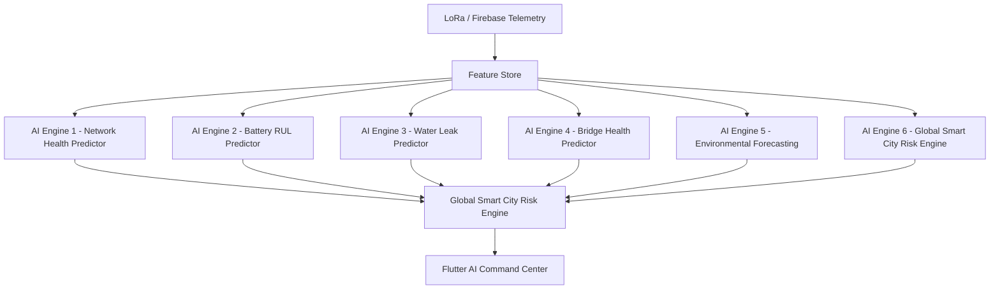

# Multi-Model AI Architecture

- Generated at: `2026-06-14T07:22:17.585717Z`
- Fusion strategy: weighted risk fusion with domain-specific guardrails and TFLite anomaly score

## Engines

### AI Engine 1 - Network Health Predictor
- Inputs: RSSI, SNR, packet loss, node uptime
- Outputs: RSSI next hour, SNR next hour, communication failure probability

### AI Engine 2 - Battery RUL Predictor
- Inputs: battery percentage, battery decay rate, RSSI, domain
- Outputs: remaining battery %, days to battery failure

### AI Engine 3 - Water Leak Predictor
- Inputs: pipe soil, tank levels, difference, rain, leak status
- Outputs: leak probability 6h, leak probability 24h

### AI Engine 4 - Bridge Health Predictor
- Inputs: cars inside, danger switches, vibration, tilt, gate state
- Outputs: structural stress score, failure risk, maintenance priority

### AI Engine 5 - Environmental Forecasting
- Inputs: temperature, humidity, pressure, air quality, smoke/gas
- Outputs: air quality tomorrow, pollution score, drought probability

### AI Engine 6 - Global Smart City Risk Engine
- Inputs: all engine outputs, TFLite anomaly score, alerts, gateway health
- Outputs: global risk score, root cause, recommended action
